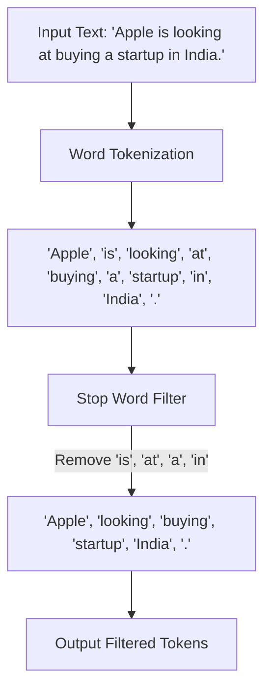

# Practical 1: Tokenization and Stop Word Removal

## Aim
To perform Text Preprocessing (Tokenization and Stop Word removal).

## Objective
To split text into meaningful tokens and remove unnecessary words for better NLP model inputs.

## Code Explanation

```python
import nltk
nltk.download('punkt')
nltk.download('stopwords')

from nltk.tokenize import word_tokenize
from nltk.corpus import stopwords

texts = [
    "Apple is looking at buying a startup in India."
]

stop_words = set(stopwords.words('english'))

for text in texts:
    tokens = word_tokenize(text)
    filtered = [word for word in tokens if word.lower() not in stop_words]

    print("Original:", text)
    print("Tokens:", tokens)
    print("After Stopword Removal:", filtered)
```

### Detailed Breakdown:
1. **Library Imports**: We import `nltk`, specifically `word_tokenize` to split the text into words and `stopwords` to filter out common English words.
2. **Downloading Resources**: The corpus for stopwords and the tokenizer model (`punkt`) are downloaded.
3. **Defining Stop Words**: `stop_words` is initialized as a set of common English stopwords (e.g., 'is', 'at', 'a', 'in').
4. **Processing**: For each text in our list, it is first tokenized into a list of words. Then, a list comprehension filters out any word that exists in the `stop_words` set.

## Mermaid Diagram



## Conclusion
Text preprocessing helps in removing unnecessary words and splitting text into meaningful tokens. It improves the quality of input for NLP models.
