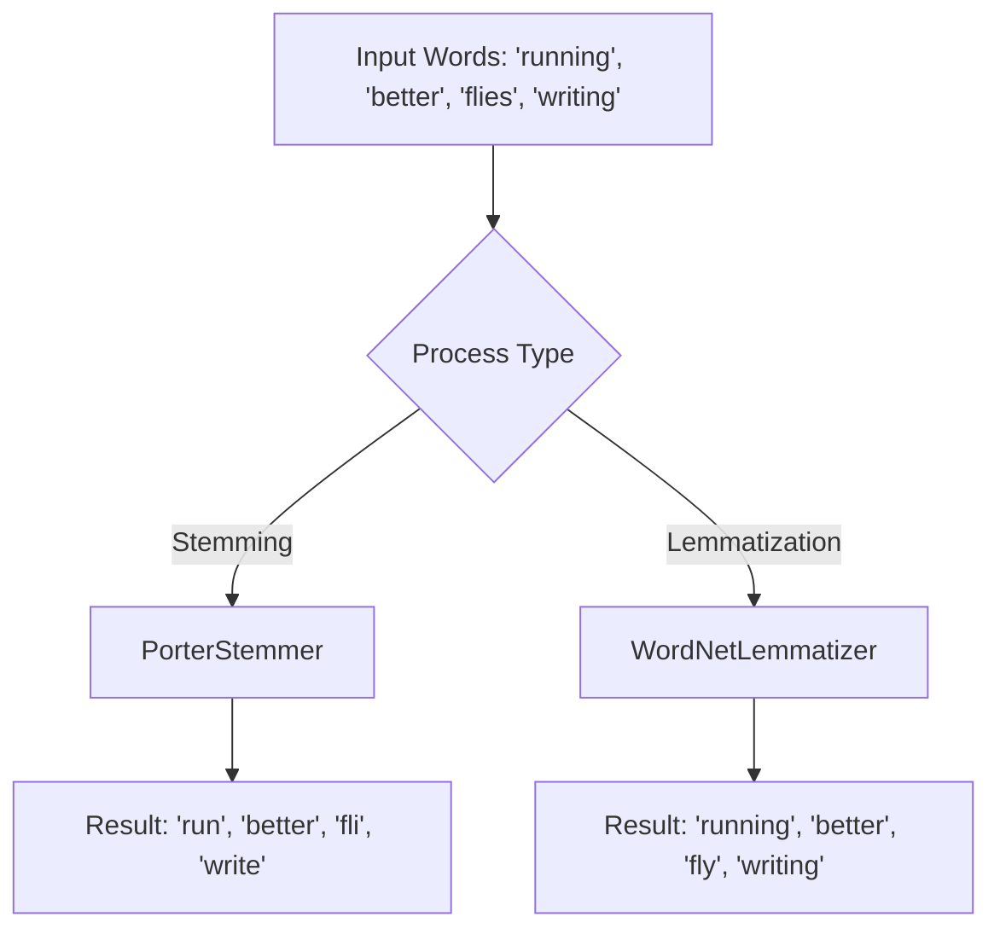

# Practical 2: Stemming and Lemmatization

## Aim
To perform stemming and lemmatization.

## Objective
To reduce words to their root forms.

## Code Explanation

```python
import nltk
nltk.download('wordnet')

from nltk.stem import PorterStemmer, WordNetLemmatizer

words = ["running", "better", "flies", "writing"]

stemmer = PorterStemmer()
lemmatizer = WordNetLemmatizer()

print("Stemming:")
for w in words:
    print(w, "->", stemmer.stem(w))

print("\nLemmatization:")
for w in words:
    print(w, "->", lemmatizer.lemmatize(w))
```

### Detailed Breakdown:
1. **Library Imports**: We import `PorterStemmer` for stemming and `WordNetLemmatizer` for lemmatization from `nltk.stem`. We also download the `wordnet` corpus which is required for lemmatization.
2. **Initialization**: We create instances of `PorterStemmer` and `WordNetLemmatizer`.
3. **Execution**: We iterate through a list of words. For stemming, `stemmer.stem()` heuristically chops off the ends of words in the hope of achieving the goal correctly. For lemmatization, `lemmatizer.lemmatize()` uses vocabulary and morphological analysis of words to remove inflectional endings and return the base or dictionary form of a word.

## Mermaid Diagram



## Conclusion
Stemming is faster but less accurate (can produce non-words like 'fli'), while lemmatization gives meaningful root words using vocabulary knowledge.
