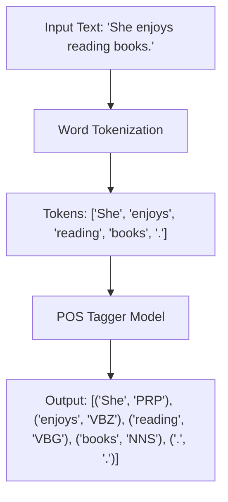

# Practical 3: Part-of-Speech Tagging

## Aim
To perform Part-of-Speech tagging.

## Objective
To identify grammatical roles of words.

## Code Explanation

```python
import nltk
nltk.download('averaged_perceptron_tagger')

from nltk.tokenize import word_tokenize

text = "She enjoys reading books."

tokens = word_tokenize(text)
pos_tags = nltk.pos_tag(tokens)

print("Tokens:", tokens)
print("POS Tags:", pos_tags)
```

### Detailed Breakdown:
1. **Library Imports**: We import `word_tokenize` to split the sentence into individual words. We also ensure that the `'averaged_perceptron_tagger'` model is downloaded, which is used by NLTK to assign POS tags.
2. **Tokenization**: The input sentence `"She enjoys reading books."` is broken down into a list of words and punctuation.
3. **POS Tagging**: The NLTK `pos_tag` function takes the tokenized list and assigns a linguistic tag to each word, denoting whether it is a noun, verb, pronoun, etc. (e.g., 'She' -> 'PRP' for personal pronoun).

## Mermaid Diagram



## Conclusion
POS tagging helps in understanding sentence structure and improves tasks like parsing and translation.
