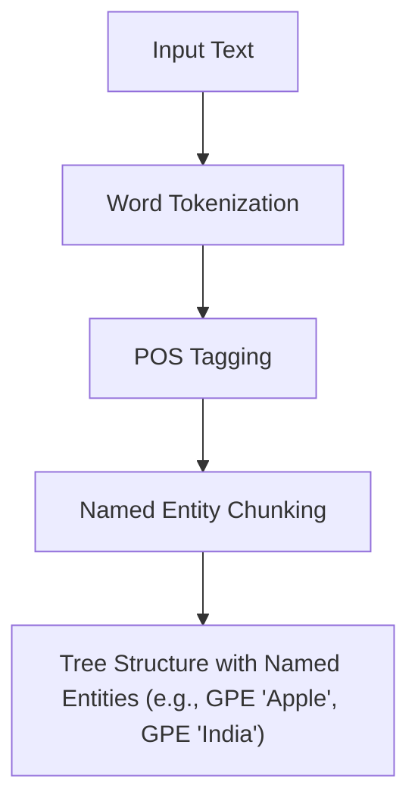

# Practical 4: Named Entity Recognition

## Aim
To identify named entities in text.

## Objective
To extract names, organizations, and locations.

## Code Explanation

```python
import nltk
nltk.download('maxent_ne_chunker')
nltk.download('words')

from nltk import word_tokenize, pos_tag, ne_chunk

text = "Apple is looking at buying a startup in India."

tokens = word_tokenize(text)
tags = pos_tag(tokens)
entities = ne_chunk(tags)

print(entities)
```

### Detailed Breakdown:
1. **Library Imports**: We import `word_tokenize`, `pos_tag`, and `ne_chunk` from `nltk`. We download `maxent_ne_chunker` and `words` datasets necessary for extracting entities.
2. **Tokenization and POS Tagging**: The sentence is first split into tokens and then labeled with their Part-of-Speech tags, as Named Entity Recognition (NER) models heavily rely on POS features.
3. **NER Chunking**: `ne_chunk` takes the list of POS-tagged words and groups them into chunks, labeling specific chunks as entities (e.g., classifying 'Apple' as an Organization/GPE and 'India' as a Geopolitical Entity).

## Mermaid Diagram



## Conclusion
NER helps in extracting useful information like names and places from unstructured text.
