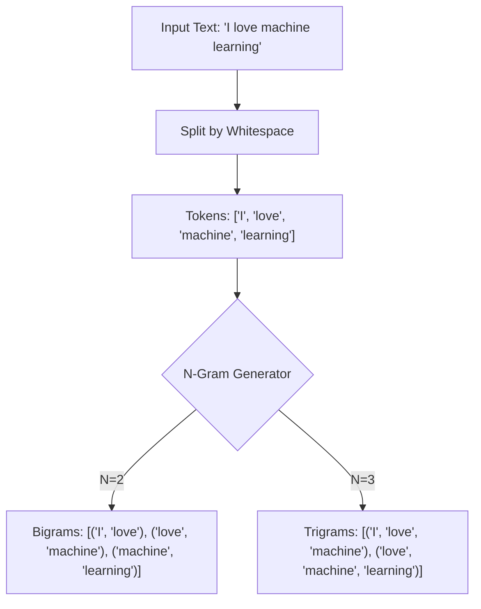

# Practical 5: N-Grams

## Aim
To generate N-grams from text.

## Objective
To understand word sequences.

## Code Explanation

```python
from nltk.util import ngrams

text = "I love machine learning"
tokens = text.split()

bigrams = list(ngrams(tokens, 2))
trigrams = list(ngrams(tokens, 3))

print("Bigrams:", bigrams)
print("Trigrams:", trigrams)
```

### Detailed Breakdown:
1. **Library Imports**: We import the `ngrams` function from `nltk.util`. N-grams are continuous sequences of n items from a given sample of text.
2. **Tokenization via Split**: The string `"I love machine learning"` is split into tokens based on whitespace.
3. **Generating Bigrams**: `ngrams(tokens, 2)` generates word pairs that appear consecutively in the text.
4. **Generating Trigrams**: `ngrams(tokens, 3)` generates triplets of words that appear consecutively.

## Mermaid Diagram



## Conclusion
N-grams help in predicting next words and are widely used in language models.
