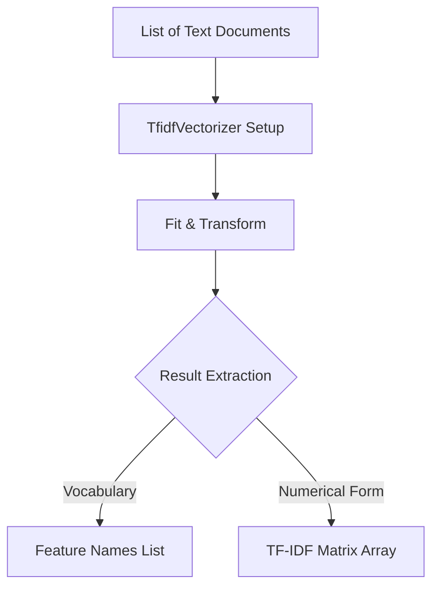

# Practical 6: Term Frequency-Inverse Document Frequency (TF-IDF)

## Aim
To convert text into numerical features using TF-IDF.

## Objective
To measure importance of words in a document relative to a corpus.

## Code Explanation

```python
from sklearn.feature_extraction.text import TfidfVectorizer

texts = [
    "I love machine learning",
    "Machine learning is amazing",
    "I love coding"
]

vectorizer = TfidfVectorizer()
X = vectorizer.fit_transform(texts)

print("Feature Names:", vectorizer.get_feature_names_out())
print("TF-IDF Matrix:\n", X.toarray())
```

### Detailed Breakdown:
1. **Library Imports**: We import `TfidfVectorizer` from `sklearn.feature_extraction.text`.
2. **Data Preparation**: A list of documents/sentences is defined.
3. **Vectorization**: We initialize the vectorizer and fit it to our text data. `fit_transform` learns the vocabulary dictionary and returns a document-term matrix using the TF-IDF weighting scheme. 
    - Words that appear frequently in a document but rarely in the corpus get a high TF-IDF score.
    - Common words across all documents get lower scores.
4. **Output Properties**: `get_feature_names_out()` prints the learned vocabulary (alphabetical terms), and `X.toarray()` outputs the dense numerical representation matrix.

## Mermaid Diagram



## Conclusion
TF-IDF highlights important words while reducing the impact of common words.
