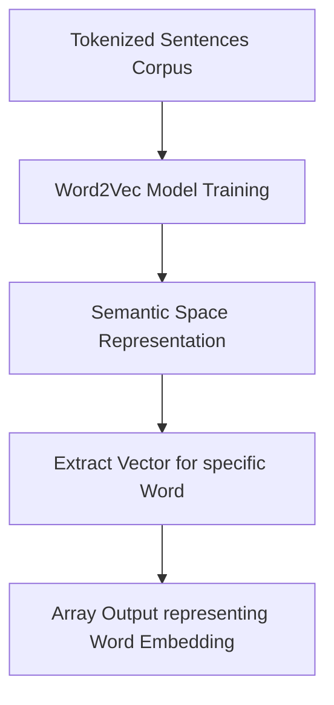

# Practical 7: Word Embeddings (Word2Vec)

## Aim
To generate word embeddings.

## Objective
To represent words as high-dimensional vectors, preserving semantic context.

## Code Explanation

```python
from gensim.models import Word2Vec

sentences = [
    ["i", "love", "machine", "learning"],
    ["machine", "learning", "is", "fun"],
    ["i", "love", "coding"]
]

model = Word2Vec(sentences, vector_size=50, window=2, min_count=1)

print("Vector for 'machine':")
print(model.wv['machine'])
```

### Detailed Breakdown:
1. **Library Imports**: We import `Word2Vec` from `gensim.models`.
2. **Corpus Preparation**: Provide a list of tokenized sentences. 
3. **Model Initialization and Training**: `Word2Vec(sentences, ...)` trains the model on the given dataset. 
    - `vector_size=50` creates 50-dimensional vectors for each word.
    - `window=2` specifies the maximum distance between the current and predicted word within a sentence.
    - `min_count=1` means the model considers all words that occur at least once.
4. **Extracting Vectors**: We retrieve the numerical embedding representation of the word `"machine"` using `model.wv['machine']`.

## Mermaid Diagram



## Conclusion
Word embeddings capture semantic meaning and relationships between words, allowing algorithms to process linguistic context in numerical bounds.
