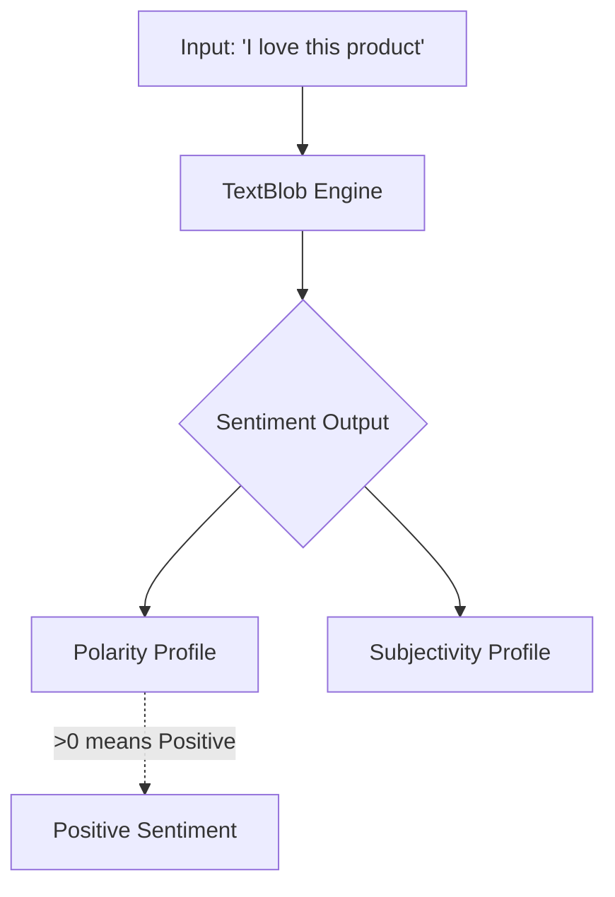

# Practical 8: Sentiment Analysis

## Aim
To perform sentiment analysis.

## Objective
To classify text as positive, negative, or neutral based on its polarity.

## Code Explanation

```python
from textblob import TextBlob

texts = [
    "I love this product",
    "This is the worst experience ever"
]

for text in texts:
    blob = TextBlob(text)
    print(text, "-> Sentiment:", blob.sentiment)
```

### Detailed Breakdown:
1. **Library Imports**: We import `TextBlob` from the `textblob` NLP library.
2. **Text Processing Loop**: For each phrase in the list, we iterate and instantiate a `TextBlob` object.
3. **Sentiment Extraction**: `blob.sentiment` returns a namedtuple of structure `(polarity, subjectivity)`.
    - **Polarity** is a float lying in the range `[-1.0, 1.0]` where 1 means positive statement and -1 means a negative statement.
    - **Subjectivity** is a float lying in the range `[0.0, 1.0]` denoting how objective (0.0) or subjective (1.0) the text is.

## Mermaid Diagram



## Conclusion
Sentiment analysis helps in understanding user opinions and feedback automatically.
